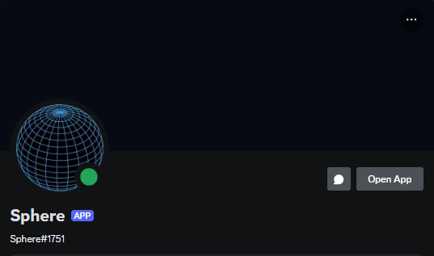

# Sphere Bot

Sphere Bot is a modular Discord bot written in **Python**, currently deployed live on a **Raspberry Pi Zero**. It responds to various commands via direct messages or in designated channels, offering utility functions for scheduled messages, uptime tracking, and pollen count information.

## DM the Bot

You can start DMing Sphere Bot directly using this link: [DM Sphere Bot](https://discord.com/users/1275637004821860402). Just message it something to get started!